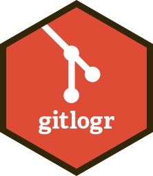

# gitlogr 

<!-- badges: start -->

<!-- badges: end -->

## Overview

gitlogr aims to provide a clean way to get your Git commit history and
process it in R.

## Installation

<!-- You can install the released version of gitlogr from [CRAN](https://CRAN.R-project.org) with: -->

<!-- ``` r -->

<!-- install.packages("gitlogr") -->

<!-- ``` -->

<!-- And  -->

The development version from [GitHub](https://github.com/) with:

``` r
# install.packages("devtools")
devtools::install_github("aldomann/gitlogr")
```
